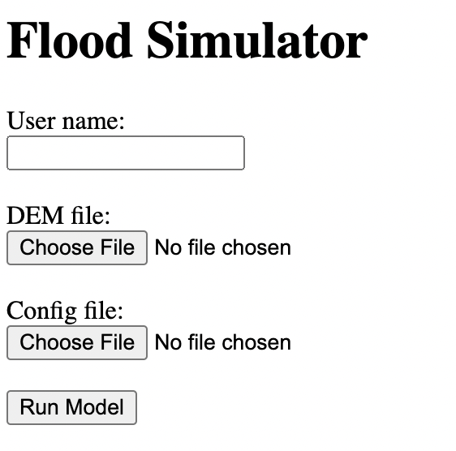

Flood App
============

A web application for overland flow simulation using Landlab.

Quickstart
----------

Use `conda` to install the necessary requirements and `flood_app`,

.. code::

    $ git clone https://github.com/gantian127/flood_app
    $ cd flood_app
    $ conda install --file=requirements.txt -c conda-forge
    $ pip install .

Start the server,

.. code::

    $ start-app --port=80 --host=0.0.0.0

Look at the line containing `Serving on` to see what host and port the
server is running on. Alternatively, you can use the `--host` and `--port`
options to specify a specific host and port (`--help` for help).

Now you can open a web browser and go to http://0.0.0.0, which will show a
user interface to run the overland flow simulation.

Docker
------

To build a new docker image that will be a flood_app server,

.. code::

    docker build . -t flood_app

After building, run the server,

.. code::

    docker run -it -p 80:80 flood_app

Once running, you can open a web browser and go to http://0.0.0.0, which will show a
user interface to run the overland flow simulation.
