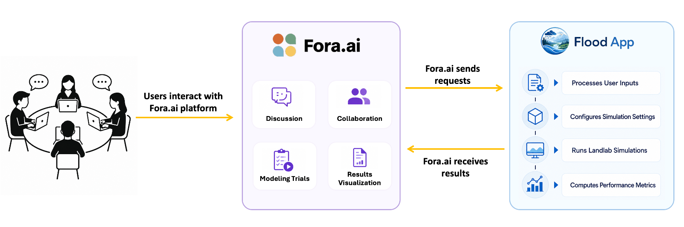

Introduction
============

Overview
--------
Flood App is a RESTful web service that integrates with the
`Fora.ai platform <https://fora.northeastern.edu/>`_ to support
participatory watershed modeling. Built on `Landlab <https://landlab.csdms.io/>`_,
the service performs watershed-scale simulations of surface runoff and soil
infiltration based on user-defined landscape conditions and mitigation interventions.

Community users interact through the Fora.ai platform to discuss, collaborate, and
design modeling scenarios that incorporate mitigation measures such as berms and mulch.
Fora.ai sends GeoJSON-based map data to Flood App through a REST API, where the inputs
are processed and translated into physics-based simulations using Landlab components.
Simulations are executed asynchronously, and the resulting outputs are returned to
Fora.ai for visualization, scenario comparison, and decision support.

The system is designed to facilitate participatory modeling, enabling stakeholders to
evaluate alternative mitigation strategies, assess flood impacts, and support watershed
management decisions.

Intervention Types
-----------------------

Three intervention types can be applied to landscape cells via the GeoJSON input.

.. list-table::
   :header-rows: 1
   :widths: 20 80

   * - Type
     - Description
   * - ``berm_low``
     - Raises cell elevation by 1 m and adjusts hydraulic conductivity and Manning’s roughness.
   * - ``berm_high``
     - Raises cell elevation by 2 m and adjusts hydraulic conductivity and Manning’s roughness.
   * - ``mulch``
     - Modifies hydraulic conductivity and Manning’s roughness; no change to terrain elevation.

Input Example
---------------------

An example request JSON file can be found in
:download:`test_request_geojson_valid.json <../tests/data/test_request_geojson_valid.json>`.

Output Files
------------

.. list-table::
   :header-rows: 1
   :widths: 40 60

   * - File
     - Contents
   * - ``surface_water_depth_<t>.json``
     - Per-timestep water depth grid
   * - ``infiltration_<t>.json``
     - Per-timestep infiltration depth grid
   * - ``max_water_depth.asc``
     - Maximum water depth (ESRI ASCII)
   * - ``max_surface_water_depth_final.json``
     - Maximum water depth grid (JSON)
   * - ``watershed_elevation.json``
     - Elevation grid of delineated watershed
   * - ``outlet_discharge.csv``
     - Time series of outlet discharge
   * - ``cum_result_test.txt``
     - Cumulative discharge percentage
   * - ``infil_result.txt``
     - Cumulative infiltration percentage
   * - ``evaluation_results.txt``
     - Damage cost, flooded area, investment NPV

.. GeoJSON Coordinate Convention
.. ------------------------------
..
.. ``features[i].properties.x`` is the **column index** and ``.y`` is the
.. **row index** — the opposite of the usual geographic (x = east, y = north)
.. convention.  This matches the upstream platform format and must not be swapped.

.. Configuration
.. -------------
..
.. ``flood_app/config_file.toml`` is the template for every run.  At request time
.. ``app.py`` copies it, injects per-request paths (``grid_file``, ``outlet_id``,
.. etc.) and any ``modelParameters`` overrides from the request body, then writes
.. the result to ``user_upload/<uuid>/config_file.toml``.
..
.. Request Lifecycle
.. -----------------
..
.. 1. ``POST /submit_simulation`` — validates the API key, parses the GeoJSON
..    payload, converts it to ESRI ASCII grid files, writes a ``config_file.toml``,
..    and spawns a background thread.
.. 2. The thread runs :class:`~flood_app.model.FloodSimulator` (overland flow +
..    Green-Ampt infiltration) then :class:`~flood_app.evaluation.ModelEvaluation`
..    (flood area, damage cost, investment NPV), writes a status file, and zips
..    the output directory.
.. 3. ``GET /check_status/<uuid>`` reads the status file.  When the simulation is
..    complete the zip archive can be streamed back with ``?download=true``.
..
.. Concurrency
.. -----------
..
.. A single :class:`threading.Semaphore` (value ``1``) serialises model runs —
.. only one simulation executes at a time; additional requests queue up.